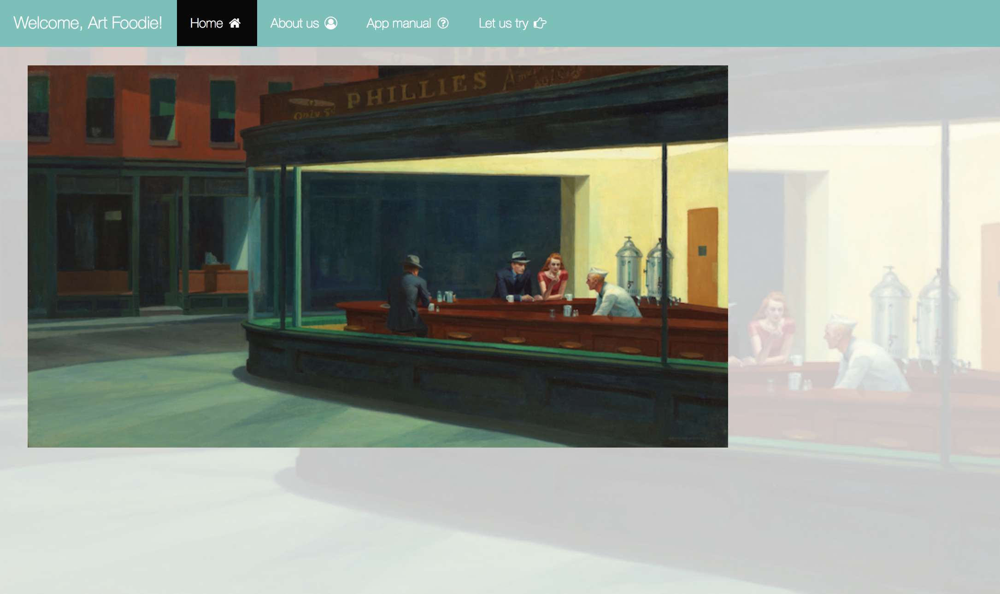
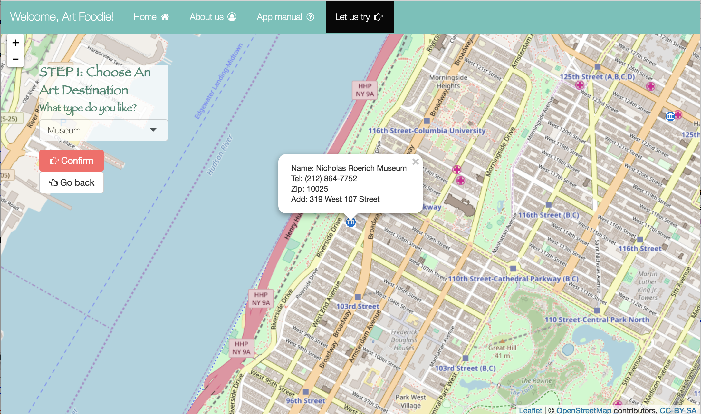
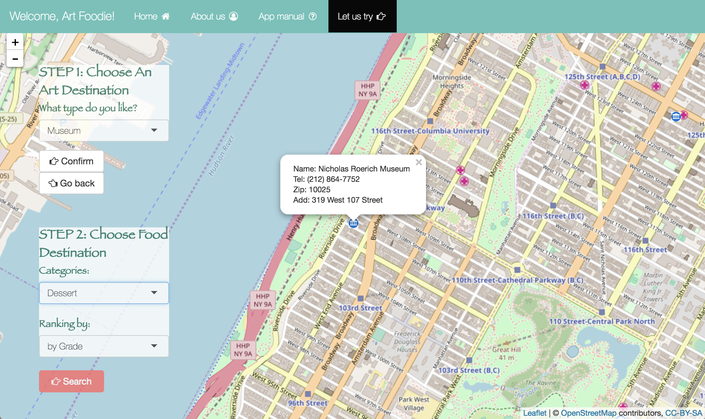
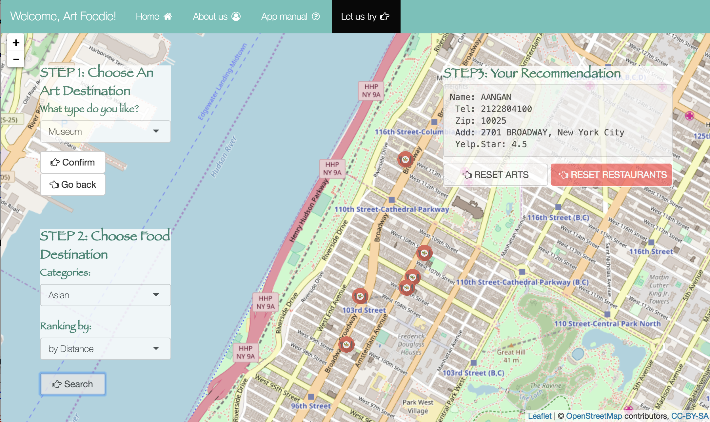

# Project 2: Open Data App - an RShiny app development project

## Project Title: Art Foodie: Find your favorite restaurants around museums and theaters in New York
Term: Fall 2017

+ Team 5
+ Team members(Alphabetical ordering of family name)
	+ Tiantian Chen
	+ Yajie Guo
	+ Stephanie Park
	+ Qian Shi



+ **Background**: There are so many restaurant-oriented Apps which you can download online, for example, Yelp, the most well-known restaurants recommendation application all over the North America. However, when we want to search for one type restaurant near a specific spot, it can’t give us the most efficient result on the ground of advertisements, etc. Another, museum and theaters in New York City attract tons of tourists come here every year. If there is an App which can give art lovers the most suitable advice about where they should dine around museums and theaters in New York, it’ll be more convenient for their travel. Our App is created for that.

+ **Project summary**: Our project is to show the restaurants near museums or theaters in New York that perfectly match users’ requirements. By choosing destination, users can decide where they want to have meals nearby, museums or theaters. Then they can choose what type of food they are looking for and rank them by grade or distance. Lastly, the selected restaurants will be shown.


+ **Contribution statement**: ([default](doc/a_note_on_contributions.md)) All team members contributed equally in all stages of this project. All team members approve our work presented in this GitHub repository including this contributions statement. 

+ **App Operation Instruction**: 

Try our App [Art Foodie] via Link: 

Go to the "Let us try", start designing your trip!

Firstly, choose the type of art destination you like. Our app provides you with the choice between museums and theaters. Markers on the map will be shown after you make your choice. Click the marker you are interested in to find its detail. Click "confirm" button if you decide go there, else you can click "Go back" to look for other destinations. 


Secondly, search the restaurants near your art destination. Choose the food type and ranking preference so that our map will show the restaurants best meeting your need on the map. Also, the best choice will display on the screen and show the detail. With our nice app, of course you could choose both your art destination and food destination again by simply click "Reset arts" or "Reset restaurants" button. Enjoy!





Following [suggestions](http://nicercode.github.io/blog/2013-04-05-projects/) by [RICH FITZJOHN](http://nicercode.github.io/about/#Team) (@richfitz). This folder is orgarnized as follows.

```
proj/
├── app/
├── lib/
├── data/
├── doc/
└── output/
```

Please see each subfolder for a README file.

